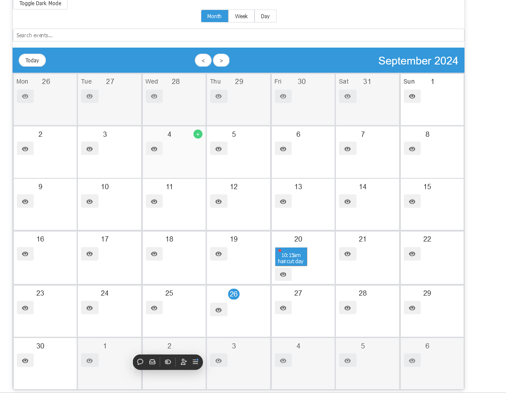

# Calendar Project

A feature-rich calendar application that allows users to view and manage events in different formats: monthly, weekly, and daily. This project utilizes modern JavaScript and CSS for a responsive and interactive user experience.

## Demo

You can view the live demo of the application here: [Live Demo](https://calender-jfiwhxr2o-ayushg701s-projects.vercel.app)



## Features

### Current Features

- **Monthly View**: Displays events organized by month.
- **Weekly View**: Shows events organized by week, from Sunday to Saturday.
- **Daily View**: Focuses on a single day's events.
- **Event Search**: Allows users to search for events by name.
- **Dark Mode**: Users can toggle between light and dark themes.
- **Responsive Design**: The calendar adapts to different screen sizes for a seamless experience on all devices.

### Enhancements

- **Improved UI Elements**: Enhanced button designs with icons for better usability.
- **Dynamic View Switching**: Users can easily switch between month, week, and day views with highlighted active states.
- **Event Overflow Management**: Ensures events do not overlap and are displayed clearly.
- **Event Creation and Management**: Functionality to create, edit, and delete events is planned for future releases.

## Getting Started

To get a local copy up and running, follow these simple steps:

### Prerequisites

- Ensure you have [Node.js](https://nodejs.org/) installed on your machine.
- Clone the repository to your local machine.

### Installation

1. Clone the repository:
   ```bash
   git clone https://github.com/yourusername/your-repo-name.git
   ```
