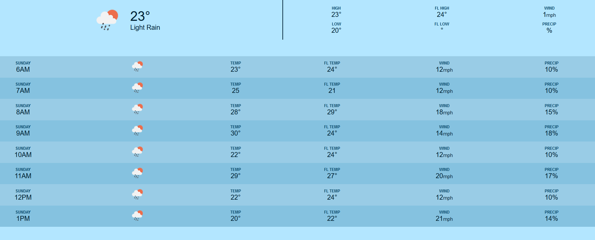

<h1>Weather API</h1>

A simple weather application that provides current weather and 5-day forecast data using the OpenWeatherMap API. The server is built with Express and uses Axios for making API requests.

<h2>Features</h2>
<ul>
    <li>Fetch current weather data based on latitude and longitude.</li>
    <li>Fetch 5-day weather forecast data, available in both daily and hourly formats.</li>
</ul>

<h2>Technologies Used</h2>
<ul>
    <li>Node.js</li>
    <li>Express</li>
    <li>Axios</li>
    <li>OpenWeatherMap API</li>
    <li>dotenv for environment variable management</li>
</ul>

<h2>Getting Started</h2>

<h3>Prerequisites</h3>
<ul>
    <li>Node.js and npm installed on your machine.</li>
    <li>An API key from <a href="https://openweathermap.org/api">OpenWeatherMap</a>.</li>
</ul>

<h3>Installation</h3>
<ol>
    <li>Clone the repository:
        <pre><code>git clone &lt;repository-url&gt;
cd weather-api</code></pre>
    </li>
    <li>Install the dependencies:
        <pre><code>npm install</code></pre>
    </li>
    <li>Create a <code>.env</code> file in the root directory and add your OpenWeatherMap API key:
        <pre><code>API_KEY=your_openweathermap_api_key</code></pre>
    </li>
</ol>

<h3>Running the Application</h3>

To start the server, run the following command:

<pre><code>npm start</code></pre>

The server will run on <code>http://localhost:3001</code>.

<h2>API Endpoints</h2>

<h3>1. Get Current Weather</h3>
<ul>
    <li><strong>Endpoint</strong>: <code>/weather</code></li>
    <li><strong>Method</strong>: <code>GET</code></li>
    <li><strong>Query Parameters</strong>:
        <ul>
            <li><code>lat</code>: Latitude of the location (required).</li>
            <li><code>lon</code>: Longitude of the location (required).</li>
        </ul>
    </li>
</ul>

<h4>Example Request:</h4>
<pre><code>GET http://localhost:3001/weather?lat=44.34&lon=10.99</code></pre>

<h4>Example Response:</h4>
<pre><code>{
  "currentTemp": 25,
  "highTemp": 28,
  "lowTemp": 23,
  "highFeelsLike": 27,
  "windSpeed": 5,
  "icon": "10d",
  "description": "light rain"
}</code></pre>

<h3>2. Get Weather Forecast</h3>
<ul>
    <li><strong>Endpoint</strong>: <code>/forecast</code></li>
    <li><strong>Method</strong>: <code>GET</code></li>
    <li><strong>Query Parameters</strong>:
        <ul>
            <li><code>lat</code>: Latitude of the location (required).</li>
            <li><code>lon</code>: Longitude of the location (required).</li>
        </ul>
    </li>
</ul>

<h4>Example Request:</h4>
<pre><code>GET http://localhost:3001/forecast?lat=44.34&lon=10.99</code></pre>

<h4>Example Response:</h4>
<pre><code>{
  "daily": [
    {
      "date": "Fri Sep 27 2024",
      "highTemp": 29,
      "lowTemp": 24,
      "icon": "04n",
      "description": "broken clouds"
    }
  ],
  "hourly": [
    {
      "timestamp": 1727352000000,
      "icon": "10d",
      "temp": 25,
      "feelsLike": 27,
      "windSpeed": 5,
      "precip": 39
    }
  ]
}</code></pre>

<h2>License</h2>

This project is licensed under the MIT License.

<h2>Acknowledgments</h2>

<a href="https://openweathermap.org/api">OpenWeatherMap</a> for providing weather data.

Click the button below to view a preview of the Weather App:

<button onclick="toggleDemo()" style="padding: 10px; background-color: #007BFF; color: white; border: none; border-radius: 4px; cursor: pointer;">
    Toggle Demo Image
</button>

    

